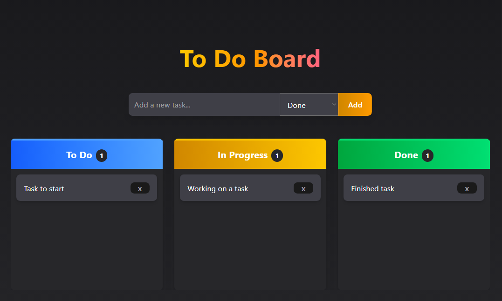

# To Do Board
This project is a React web app made to show a To Do List Board connected to a Java Back-End API to save a pendings or todo list in a drag&drop kanban style.

## Front-End Links
- [GitHub Repo](https://github.com/NewIncome/react-kanban-board)
- [:globe_with_meridians: Live link](https://react-kanban-board.jalfred.dev)

## Back-End / API Links
- [API GitHub Repo](https://github.com/NewIncome/kanban-board-api)
- [API Live Version](https://kanban-board-api-a583.onrender.com/api)

## Built With 

- REACT
- NPM
- TAILWIND

## Getting Started

In order to start with this project you need the next:

1. Get a copy of this project [this repository :blue_book:](https://github.com/NewIncome/find_your_item/tree/feature/app-w-nodeV12)

Once you have cloned this project
1. Go to project folder
2. run `npm install` or `yarn install`
3. run `npm start`

## Improvements

Features pending to add to this app:
- change data persistence method

## Creators
Author | Social Media
:--------------:|:------------:
👤 | - Github: [@NewIncome](https://github.com/NewIncome)
**Alfredo C.** | - Twitter: [@J_A_fredo](https://twitter.com/J_A_fredo)
. | - Linkedin: [Alfredo C.](https://www.linkedin.com/in/j-alfredo-c)
